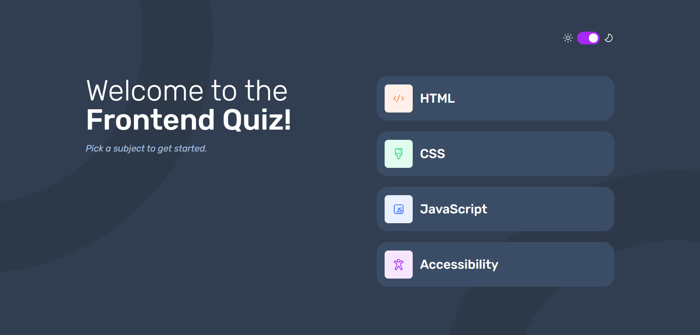
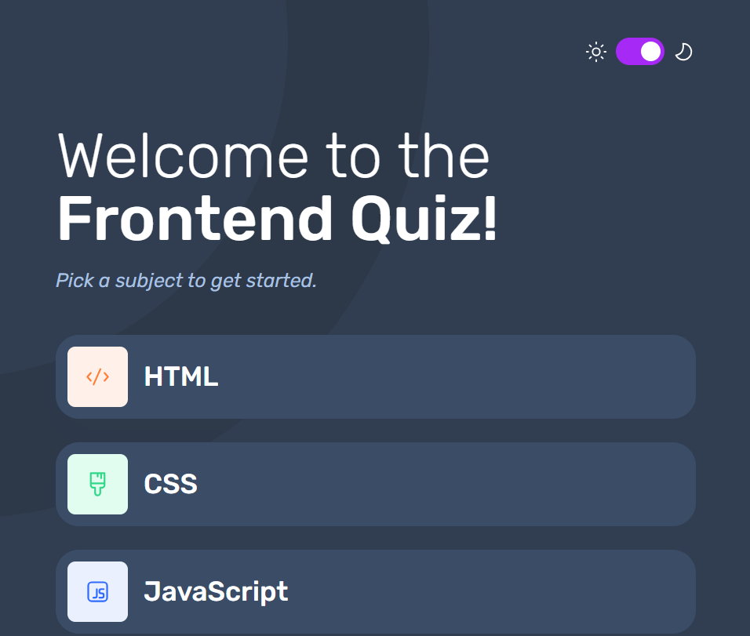
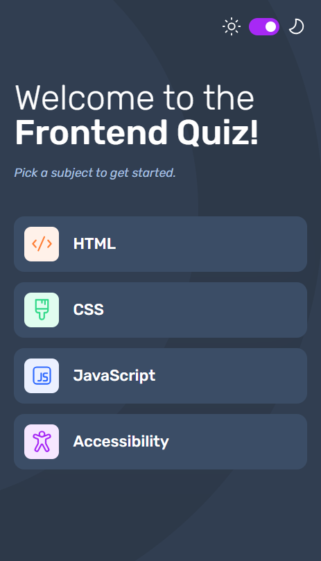

# Amalitech - Amalitech Project (Frontend Quiz App) solution

This is a solution to the Frontend quiz app challenge on Amalitech NSS.
## Table of contents

  - [Overview](#overview)
  - [The challenge](#the-challenge)
  - [Screenshot](#screenshot)
  - [Links](#links)
  - [My process](#my-process)
  - [Built with](#built-with)
  - [What I learned](#what-i-learned)
  - [Run the project](#run)

## Overview

### The challenge

Users should be able to:

- Select a quiz subject
- Select a single answer from each question from a choice of four
- See an error message when trying to submit an answer without making a selection
- See if they have made a correct or incorrect choice when they submit an answer
- Move on to the next question after seeing the question result
- See a completed state with the score after the final question
- Play again to choose another subject
- View the optimal layout for the interface depending on their device's screen size
- See hover and focus states for all interactive elements on the page
- Navigate the entire app only using their keyboard
- Change the app's theme between light and dark

### Screenshots
- Laptop view

- Tablet view

- Mobile view

### Links

- Solution URL: [https://alibaba-frontend-quiz.netlify.app/]

## My process

### Built with

- HTML5 markup
- CSS custom properties
- Flexbox
- CSS Grid
- Mobile-first workflow
- [React](https://reactjs.org/) - JS library
- TypeScript
- [Styled Components](https://styled-components.com/) - For styles

### What I learned

Learned more about working with REACT HOOKS.

## Run

- Type "npm run dev" in the terminal
